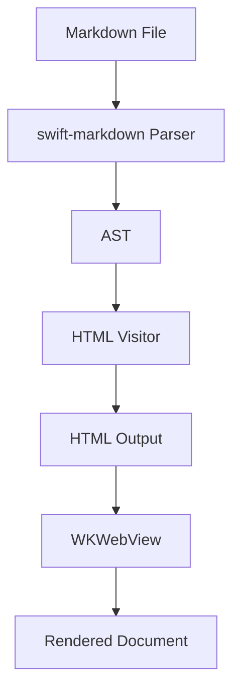
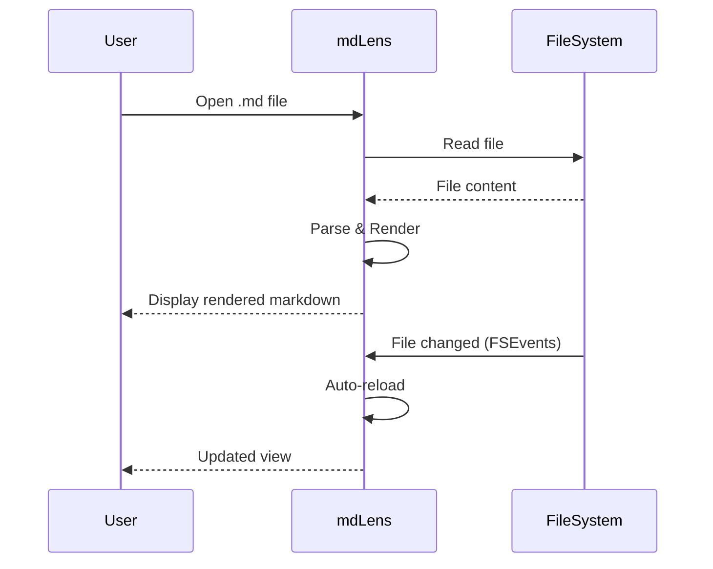

# mdLens Feature Test :rocket:

This document tests all rendering features. :tada: :sparkles:

## Code Highlighting

```swift
import SwiftUI

struct ContentView: View {
    @State private var count = 0

    var body: some View {
        VStack {
            Text("Count: \(count)")
            Button("Increment") {
                count += 1
            }
        }
    }
}
```

```python
def fibonacci(n: int) -> int:
    """Calculate the nth Fibonacci number."""
    if n <= 1:
        return n
    return fibonacci(n - 1) + fibonacci(n - 2)

# Print first 10 fibonacci numbers
for i in range(10):
    print(f"F({i}) = {fibonacci(i)}")
```

```javascript
const fetchData = async (url) => {
  try {
    const response = await fetch(url);
    const data = await response.json();
    return data.map(item => item.name);
  } catch (error) {
    console.error('Failed:', error);
  }
};
```

## Math / LaTeX :bulb:

Inline math: $E = mc^2$ and $\int_0^\infty e^{-x^2} dx = \frac{\sqrt{\pi}}{2}$

Display math:

$$
\nabla \times \mathbf{E} = -\frac{\partial \mathbf{B}}{\partial t}
$$

$$
\sum_{n=1}^{\infty} \frac{1}{n^2} = \frac{\pi^2}{6}
$$

Matrix:

$$
\begin{bmatrix} a & b \\ c & d \end{bmatrix} \begin{bmatrix} x \\ y \end{bmatrix} = \begin{bmatrix} ax + by \\ cx + dy \end{bmatrix}
$$

## Mermaid Diagrams





## Admonitions :warning:

> [!NOTE]
> This is a note admonition. Useful for highlighting information.

> [!TIP]
> This is a tip. Use mdLens for lightweight markdown viewing!

> [!IMPORTANT]
> Important information that users should be aware of.

> [!WARNING]
> Warning: This feature requires an internet connection for CDN resources.

> [!CAUTION]
> Caution: Do not edit files while viewing — this is a read-only viewer.

## Footnotes

Here is a statement that needs a citation[^1]. And another interesting fact[^2].

mdLens uses swift-markdown[^parser] for parsing and WKWebView[^webview] for rendering.

[^1]: This is the first footnote with detailed explanation.
[^2]: Second footnote — footnotes appear at the bottom of the document.
[^parser]: Apple's official Swift Markdown parser with GFM support.
[^webview]: Apple's native web rendering engine, lightweight and fast.

## Emoji Shortcodes :heart:

| Shortcode | Result |
|-----------|--------|
| `:rocket:` | :rocket: |
| `:fire:` | :fire: |
| `:white_check_mark:` | :white_check_mark: |
| `:warning:` | :warning: |
| `:thumbsup:` | :thumbsup: |
| `:star:` | :star: |
| `:heart:` | :heart: |
| `:bug:` | :bug: |
| `:100:` | :100: |
| `:tada:` | :tada: |

## Table

| Feature | Status | Library |
|---------|--------|---------|
| Syntax Highlighting | :white_check_mark: Done | highlight.js |
| Math/LaTeX | :white_check_mark: Done | KaTeX |
| Mermaid Diagrams | :white_check_mark: Done | mermaid.js |
| Admonitions | :white_check_mark: Done | CSS only |
| Footnotes | :white_check_mark: Done | Custom parser |
| Emoji Shortcodes | :white_check_mark: Done | Lookup table |

## Task List

- [x] Project setup
- [x] Basic rendering
- [x] File opening & drag-drop
- [x] Sidebar navigation
- [x] Theme support (auto/light/dark/sepia)
- [x] File watching (FSEvents)
- [x] highlight.js integration
- [x] KaTeX math rendering
- [x] Mermaid diagrams
- [x] GitHub admonitions
- [x] Footnotes
- [x] Emoji shortcodes
- [ ] Ship it! :rocket:

---

*Built with Swift & :heart: by Sugarscone*
